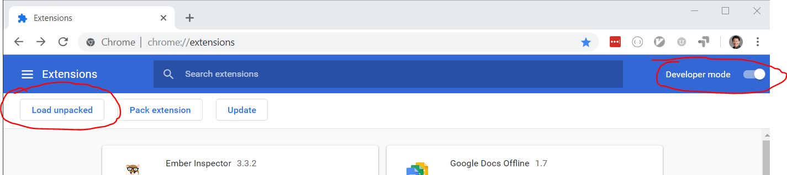
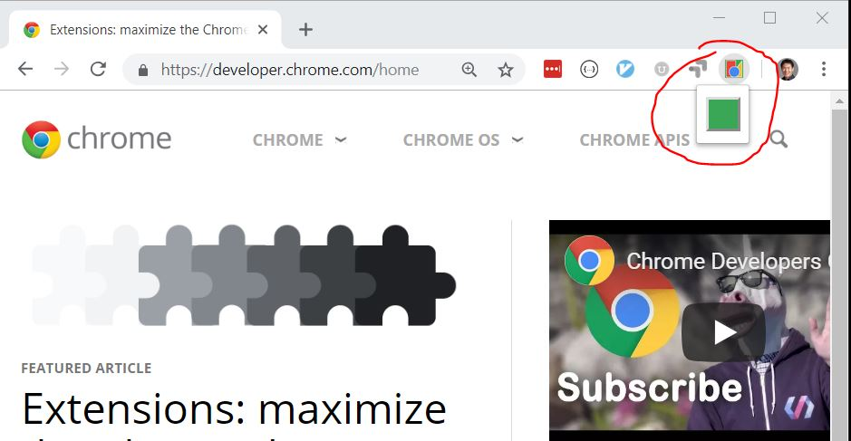
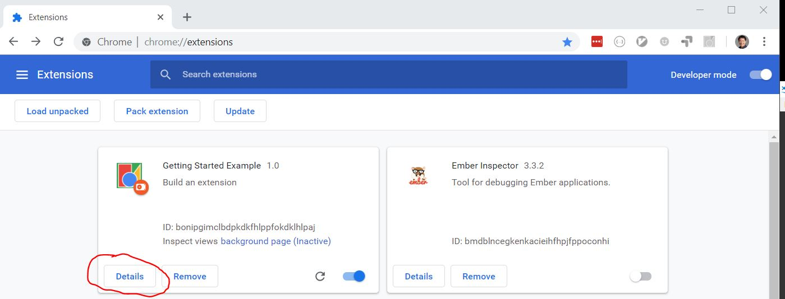
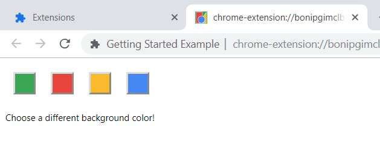
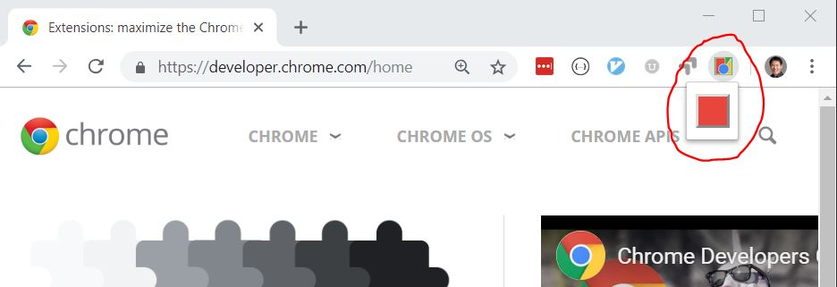

### Installation
* Go to [chrome://extensions](chrome://extensions)
* Turn on `Developer mode`
* Select `Load unpacked`

* Select this repo directory

## Use
* Go to [https://developer.chrome.com/home](https://developer.chrome.com/home)
* Click the extension icon, then click the green button

## Options
* To change color options, go to extension details:

* Open the extension options page:

* From there, select a different color:

* Now go back to [https://developer.chrome.com/home](https://developer.chrome.com/home) and you'll see the new color selection
